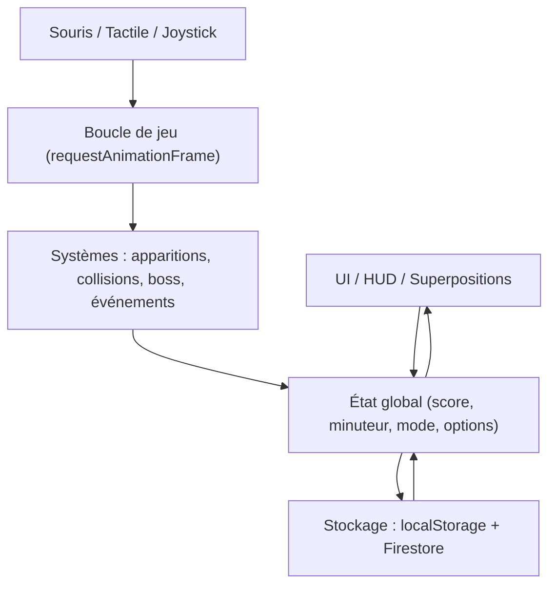
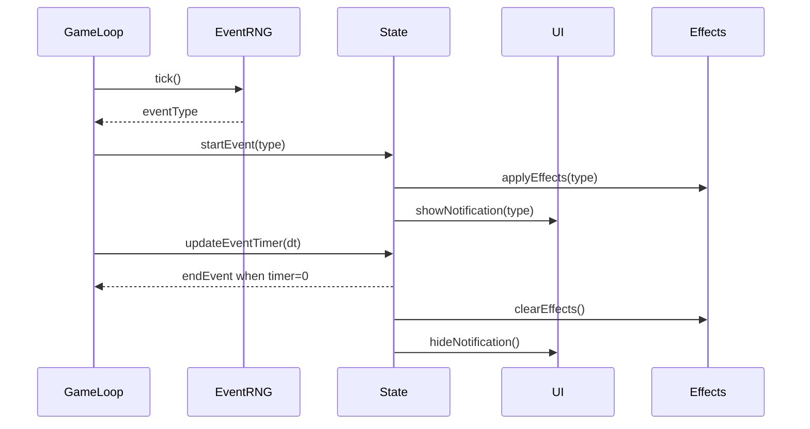

<p align="center">
  
</p>

<h1 align="center">🐟 Reef Runner</h1>

<p align="center">
  <strong>Eat. Grow. Survive.</strong>
</p>

<p align="center">
Become the king of the ocean by evolving through every stage of marine life.
</p>

<p align="center">


</p>

## Features
- **Real-time gameplay**: cursor tracking, dash, magnet, boss, enemies, and feedback particles.
- **Game modes**: Normal, Endless, Time Attack.
- **Random events**: storm, blood thirst, tide, bioluminescent plankton, murky water, surprise attack.
- **Skins & Aquarium**: shop, NEW badges, equipment, rarities.
- **Advanced options**: boss speed multiplier, time, visual toggles (parallax, caustics, swimmers).
- **Mobile**: virtual joystick, adaptive HUD, reduced performance mode..

## Tech Stack
- **HTML5 / CSS3 / JavaScript ES6**
- **Firebase (Firestore + Analytics)** pour la sauvegarde et le leaderboard
- **localStorage** pour la persistance client
- **Optimisations DOM** : pooling, contain, will-change, content-visibility

## Structure
- [index.html](index.html) : structure et UI
- [styles.css](styles.css) : styles, animations, UI responsive
- [app.js](app.js) : game logic
- [firebase.js](firebase.js) : API Firebase
- [assets/](assets/) : images et sprites

## Firebase Security
The Firebase config is not version-controlled. An (uncommitted) firebase.config.js file:

```js
window.__FIREBASE_CONFIG__ = {
  apiKey: "???",
  authDomain: "...",
  projectId: "...",
  storageBucket: "...",
  messagingSenderId: "...",
  appId: "...",
  measurementId: "..."
};
```

## ▶Run Locally
- Open index.html with a local server (Live Server recommended)
- Typical URL: `http://localhost:5500/`

## Technical Notes
- **Event loop** : `requestAnimationFrame`
- **Pooling** : bubbles and swimmers recyclés
- **Auto-pause**: inactive tab + options
- **Z-index** : overlays contrôlés pour éviter conflits UI

## Dev Details (technical)
- **Global state**: centralized runtime variables (score, timer, boss, events)
- **Systems**: separate spawns (food/bonus/malus/power) + dedicated handlers
- **Input**: mouse + touch + virtual joystick (mobile)
- **Perf**: `contain`, `will-change`, `content-visibility`, and throttled timers
- **Persistence**: `localStorage` (options/skins) + Firestore (scores)

## Diagramme (architecture)


## Schéma d’événement (runtime)

<div align="center">

## 🐟 Eat • Grow • Evolve

Made with ❤️ by **Enzo SCH**

</div>
---
